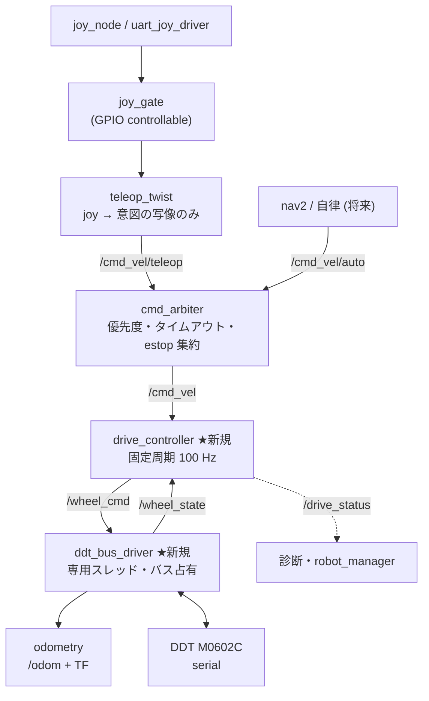

# 走行制御アーキテクチャ リファクタリング提案

対象: `joy_controller` → `drive_component` → `DifferentialDrive` → `DdtMotorLib` の走行制御経路
きっかけ: PR #141（`fix: enhance motor control parameters and improve drive responsiveness`、19 files / +861 -68 / 16 commits）
状態: 設計提案（コード変更は含まない）

---

## 0. 結論（先に3行）

1. 現状の限界は「制御層が無い」ことではなく、**制御が3層に分散したまま、制御周期そのものが存在しない**ことにある。`twistCallback` が制御ステップを兼ねているため、制御周期 = joy の到着間隔（DualShock 20 Hz / UART 50 Hz）になっている。
2. `control_module` を入れる方向性は正しい。ただし最初に入れるべきは PI や新しい制御則ではなく、**固定周期ループ**と**シリアル I/O の制御パスからの分離**である。この2つを入れないと、どんな制御則もチューニングが再現しない。
3. `target_twist` に追従できない件は、**実機だけの問題ではない**。現在のパラメータでは、フルスティックの角速度指令 6.0 rad/s に到達するまで設計上 **2.0 秒**かかる（`max_angular_accel: 3.0`）。加えて旋回指令の全域がファーム速度ループの不安定域（低 RPM）に入っている。実機なしで検算・切り分けできる部分が残っている。

---

## 1. 現状の責務配置

コード上の実態を層ごとに並べる（推測ではなく現ファイルの内容）。

| 層 | ファイル | 実際に持っている責務 |
|---|---|---|
| 入力 | `joy_controller/src/joy_controller_component.cpp` | 軸 → `Twist` の線形写像のみ。`/target_twist` を joy 受信ごとに publish |
| ゲート | `joy_gate/src/joy_gate_component.cpp` | `/gpio/controllable` による joy 遮断 |
| ノード | `motor_control_app/src/drive_component.cpp` | Lifecycle、auto_start リトライ、非常停止購読、**スルーレート/デマンド適応/テーパー**、コマンドウォッチドッグ、`/drive_status` publish、**オドメトリ積分 + TF**、パラメータ（約 30 個） |
| 運動学 | `motor_control_lib/src/differential_drive.cpp` | twist ↔ 左右 RPM 変換、**停止/走行ヒステリシス状態機械**（`stop_mode_`）、`min_command_rpm` 不感帯 |
| デバイス | `motor_control_lib/src/ddt_motor_lib.cpp` | シリアル fd、プロトコル送受信、リトライ、**電流モード PI**、**実測 RPM ローパス**、**停止再送スロットル**、ブレーキ、ファーム `accel_time`、最終フレーム保持 |

「制御」に相当するロジックは `drive_slew`（ホスト側加減速）、`drive_stop_gate`（停止判定）、`ddt_current_pi`（電流 PI）、`DdtMotorLib::setMeasuredLowpassTau`（平滑化）の4箇所に分かれ、それぞれ別の層にある。

純粋関数として切り出しテストされているのは偉い（`test_drive_slew`, `test_drive_stop_gate`, `test_ddt_current_pi`, `test_drive_watchdog`）。しかし**それらを組み合わせた閉ループ挙動をテストする場所がどこにも無い**。だから PR #141 は実機で試す以外に検証手段がなく、16 コミット・パラメータ十数個の追加になった。これは実装者の問題ではなく構造の帰結である。

---

## 2. 構造上の限界（7点）

### P1. 制御周期が存在しない（最重要）

`drive_component.cpp:562-579` — スルーレート制限の `dt` は `/target_twist` の到着間隔である。

```cpp
double dt = drive_slew::normalizeDt(has_last_cmd_, has_last_cmd_ ? (now - last_cmd_time_).seconds() : 0.0);
```

帰結:

- 制御周期が上流依存。`joy_node` の `autorepeat_rate: 20.0`（DualShock）と `uart_joy_driver` の `publish_rate: 50.0` で、**同じパラメータのまま実効加速度プロファイルが変わる**。
- `/target_twist` の QoS は depth 1（`drive_component.cpp:207`）。エグゼキュータが詰まって取りこぼすと、その分のランプが単純に消える（`normalizeDt` の上限 0.1 s で取り戻せない）。設定値 3.0 m/s² より**実効加速度が必ず小さくなる**方向。
- スティックを離した瞬間の減速も同じ経路なので、停止応答も joy レートに依存する。

### P2. ブロッキング I/O が制御コールバック内にある

`twistCallback` → `DifferentialDrive::setVelocity` → 左右それぞれ `DdtMotorLib::sendFrameWithFeedback`。中身は `tcflush` → `write` → **最大 10 ms の応答待ち**（`ddt_motor_lib.cpp:545`）。

57600 baud 8N1 = 5,760 B/s。10 バイトフレーム = 1.74 ms、指令+フィードバックの往復で約 3.5 ms。

- 正常時: 2 モータ = 約 7 ms をサブスクリプションコールバック内で消費。
- フィードバック落ち: 10 ms × 2 = **20 ms** ブロック。
- さらに `statusTimerCallback`（50 Hz、`status_publish_rate: 50.0`）が `refreshMotorFeedback` を左右に呼ぶ。これも最悪 10 ms × 2。
- twist/status/watchdog/auto_start は**意図的に同一 MutuallyExclusive グループ**（`drive_component.hpp:150-153`）。つまり全部直列。

20 ms 周期（50 Hz）のステータスタイマーが最悪 20 ms 使い得る状況で、20 Hz の指令が同じスレッドと同じシリアルバスを取り合っている。**指令経路と観測経路が互いを劣化させる**構造になっている。P1 の dt ジッタの主因もこれ。

### P3. 加速プロファイルの多重化

同じ「加速の緩やかさ」を決める機構が並列に存在する。

1. ホスト `max_*_accel`（`drive_slew::clampRate`）
2. ホスト デマンド適応（`min_*_accel` / `accel_demand_ref_*`）
3. ホスト テーパー（`slew_taper_band_*`）
4. ファーム `accel_time_0p1ms_per_rpm`
5. ファーム速度ループ自体の応答
6. `min_command_rpm` 不感帯 + `stop_mode_` ヒステリシス
7. `stop_resend_interval_ms` / `brake_on_stop`

`on_configure` が「加速プロファイル支配側: firmware / host」をログに出している（`drive_component.cpp:190-203`）こと自体が、この多重性の症状である。さらに `accel_time` は左右共通の単一ファームパラメータで前後と旋回を分離できないため、コメントにあるとおり「旋回の振動は `slew_taper_band_angular` 側で押さえる」という迂回が必要になっている。

パラメータが直交していないので、1つ触ると他の効き方が変わる。これが「無理やり合わせる形」の実体。

### P4. 車体速度に対する閉ループが存在しない

- `control_mode: "velocity"` はファーム速度ループへの丸投げで、ホスト側は完全にオープンループ。
- `control_mode: "current"` は**車輪 RPM** の PI（`ddt_current_pi`）で、車体速度 (v, ω) の PI ではない。しかも実行タイミングは指令送信経路の中（= P1 と同じイベント駆動）。
- 実測 twist は `/odom` として publish されているのに（`publishOdometry`）、**それが制御に戻る配線が存在しない**。

ここが一番大きな構造上の穴で、「`target_twist` に追従できない」に対して打つ手が現状ホスト側に無い理由でもある。

### P5. 指令の調停点が無い

`/target_twist` は `joy_controller` 単独 publisher 前提（トピック名も `drive_component.cpp:208` でハードコード）。将来 nav2 / 自律走行 / 自動照準が入ったとき、誰の指令を優先するかを決める場所がない。

非常停止も同様に分散している: `drive_component` / `shot_component` / `esc_motor_control` がそれぞれ `/emergency_stop` を購読し、各自の解釈で停止する。契約は `questix_msgs/README.md` に書かれていて運用できているが、**安全ロジックの実装単一ソースは無い**。

### P6. デバイス層の関心事が混ざっている

`DdtMotorLib` 1クラスが、シリアル fd / termios / プロトコル codec / リトライ / モード管理 / 電流 PI / 実測 LPF / 停止再送スロットル / 最終フレーム保持を持っている（ヘッダ 300 行、`recursive_mutex` で自己再入を許している = 責務が絡んでいる証拠）。

`ddt_protocol` が純関数として分離されているのは良い。残りが混ざっている。

### P7. 観測遅れが症状の見え方を歪めている

`measured_lpf_tau_sec: 0.15` → 遮断周波数 fc ≒ 1.06 Hz、位相遅れ約 150 ms。これは `/drive_status` と `/odom` の両方に効く（制御には効かない、という設計は正しい）。

つまり **`/odom` を見て「追従できていない」と判断すると、150 ms 分は観測側の遅れ**である。加えて `refreshMotorFeedback` のポーリングタイミングはバス競合で不定なので、実効サンプリングも一定でない。切り分けを先にやる必要がある。

---

## 3. `target_twist` 追従問題の切り分け

「実機だけの問題では」という懸念に対して、**実機なしで説明できる分と実機必須の分がはっきり分かれる**。

### 3-1. 設計上そうなっている（実機不要、算数で出る）

現在の設定値（`joy_controller_params.yaml`, `launcher/config/drive_component.yaml`）:

| 項目 | 値 | フルスティック到達時間 |
|---|---|---|
| `angular_input_ratio` | 6.0 rad/s | 6.0 ÷ `max_angular_accel` 3.0 = **2.0 s** |
| `longitudinal_input_ratio` | 2.0 m/s | 2.0 ÷ `max_linear_accel` 3.0 = **0.67 s** |

デマンド適応（`demandScaledAccel`）は `max_*_accel` を**上限**として min 側へ寄せる仕組みなので、これより速くなることはない。つまり旋回はスティックを一杯に倒してから 2 秒かけてランプする。操縦感としては「追従していない」に見える。これは実機の癖ではなく設定の帰結。

さらに P1 により、joy 取りこぼし分だけ実効加速度は 3.0 rad/s² を下回る。

### 3-2. ハードの特性がアーキに合っていない（実機ログで既に判明済み）

`differential_drive.hpp:38-42` と `drive_component.yaml` のコメントに実機ログが記録されている:

> 目標 95 RPM 一定で実測 59〜118 RPM を約 1.8 Hz で往復、低速側はさらに悪化

ここで運用時の車輪 RPM を計算すると（`wheel_radius: 0.1`, `wheel_separation: 0.5`）:

- 直進 2.0 m/s フルスティック → 191 RPM
- 常用 0.5 m/s → 48 RPM
- 旋回 6.0 rad/s フルスティック → 車輪 **143 RPM**（`0.25 × ω × 95.49`）
- 旋回 1.0 rad/s → 24 RPM

**運用域のほぼ全域、特に旋回の全域が「ファーム速度ループが振動する低 RPM 域」に入っている。** M0602C の速度ループに丸投げしている限り、ホスト側でどうスルーレートを整えても定常追従誤差と 1.8 Hz 前後のリミットサイクルは残る。これは P4（ホスト閉ループ不在）が効いてくる箇所で、**アーキ変更なしでは解けない**。

### 3-3. 観測アーティファクトの可能性（実機不要で判定できる）

`measured_lpf_tau_sec: 0.15` の 150 ms 遅れ。`/target_twist` と `/odom.twist` を重ねて見ると、その分だけ位相がずれて見える。判定方法: `measured_lpf_tau_sec: 0.0` で同じ操作の rosbag を取り、位相差が縮むか確認する。

### 3-4. 実機でしか決まらないこと

- ファーム速度ループの周波数特性同定（ステップ／チャープ入力に対する実測 RPM 応答）。ホスト閉ループのゲイン上限はこれで決まる。
- `min_command_rpm` / `brake_on_stop` / `stop_resend_interval_ms` が閉ループ導入後も必要かの再評価。
- シリアル帯域: 指令 + 観測が 57600 baud に収まるか。`DdtMotorLib` の既定は 115200 で `single_ddt_motor_config.yaml` も 115200、走行だけ 57600 になっている（`drive_component.yaml`）。上げられるなら P2 の余裕が倍になる。
- バス上のモータ間干渉（左右を1本のバスで request-response している）。

### 切り分けの結論

「実機だけの問題」ではない。3-1 は設定と構造で説明でき、3-3 は測り方の問題、3-2 はアーキ変更が必要な部分。**まず 3-1 と 3-3 を潰してから 3-2 に取り組む**のが順序として正しい。

---

## 4. 目標アーキテクチャ



### 層の責務（境界の定義）

**入力層** — `joy_controller` を維持し、写像だけに限定する。加減速・不感帯・状態を持たない。

**調停層 `cmd_arbiter`（新規、小さい）** — teleop / 自律 / 停止要求の優先度決定、各ソースのタイムアウト、`/emergency_stop` の一元解釈。出力は `/cmd_vel` 1本。P5 に対応。走行だけなら後回しでよいが、安全ロジックの単一ソース化の意味は大きい。

**制御層 `drive_controller`（新規、これが `control_module`）** — **固定周期（100 Hz 目安）で回るループ**。中身は ROS もシリアルも知らない純 C++ クラスとして実装する:

```cpp
// 純粋。時刻は引数、状態はメンバ、I/O なし。
struct DriveCommand { double v; double w; };
struct WheelFeedback { double left_rad_s; double right_rad_s; bool fresh; uint8_t fault; };
struct WheelCommand  { double left_rad_s; double right_rad_s; bool brake; };

class DriveController {
public:
  WheelCommand step(double dt, const DriveCommand& ref, const WheelFeedback& fb, const SafetyInput& safety);
  void reset();  // activate / estop / watchdog / fault 時
};
```

内部を段（stage）に分ける:

1. `SafetyGate` — estop / watchdog / fault → 指令をゼロへ、状態をリセット
2. `Limiter` — 速度・加速度・**ジャーク**制限を1つの実装に統合（現在の accel / demand-adaptive / taper の3層をここに畳む）
3. `ChassisLoop` — (v, ω) 目標 vs 実測の FF + PI。**ここが P4 の穴を埋める**
4. `Kinematics` — twist ↔ 左右車輪角速度（`DifferentialDrive` の変換部だけを移設）
5. `OutputShaper` — 不感帯・停止判定（現 `drive_stop_gate`）

固定周期 + 純粋 + 状態リセット明示なので、`AGENTS.md` の防止チェックリスト（制御ループ状態のリセット関数、モード遷移時の呼び出し）が構造的に守られる。

**ハードウェア層 `ddt_bus_driver`（新規）** — シリアルバスを**単独で占有**し、自前の周期で「指令送信 + フィードバック受信」を1トランザクションとして回す。制御層は最新の `/wheel_cmd` を渡すだけでブロックしない。P2 に対応。

内部を分ける（P6 に対応）:

- `ddt_protocol`（既存、純関数 codec）— そのまま流用
- `SerialTransport`（fd / termios / timeout / retry）
- `DdtDeviceSession`（モード・ブレーキ・`accel_time`・max RPM の設定と再接続）

**推定層 `odometry`** — `/wheel_state` から `/odom` + TF。制御用フィードバックと表示用フィードバックで**フィルタを分ける**（制御用は tau 小 or 生値、表示用は現行 0.15 s）。P7 に対応。

### インターフェース

`questix_msgs` に2つ追加:

```
# WheelCommand.msg
std_msgs/Header header
float64 left_velocity    # [rad/s]
float64 right_velocity   # [rad/s]
bool brake

# WheelState.msg
std_msgs/Header header
MotorFeedback left       # 既存 MotorFeedback を再利用
MotorFeedback right
float64 left_velocity    # [rad/s] 単位換算済み
float64 right_velocity
```

レイテンシのため `drive_controller` と `ddt_bus_driver` は**同一コンポーネントコンテナ + intra-process comms** に載せる。トピックにするのは観測可能性のため（rosbag で層境界が全部見える = デバッグ手段が増える）。

---

## 5. ros2_control を採用するか

Jazzy なら `diff_drive_controller` + 自作 `hardware_interface` という選択肢がある。真面目に比較する。

### ros2_control が既に持っているもの

- `controller_manager` による**固定周期 update ループ**（P1 解決）
- `diff_drive_controller` の速度・加速度・ジャーク制限（P3 の統合先）
- `cmd_vel_timeout`（現 `drive_watchdog` 相当）
- オドメトリ + TF publish（現 `publishOdometry` 相当）
- `joint_state_broadcaster` による状態の標準化、nav2 への素直な接続
- **非同期ハードウェアコンポーネント**（`ros2_control` タグの `is_async`）を使えば、10 ms のシリアル待ちを制御周期から切り離せる（P2 解決）。Jazzy での挙動・設定は採用判断前に実機で要検証

つまり `DriveComponent` が手書きしている機能の**大半が既製品としてある**。

### それでも足りないもの / コスト

- `diff_drive_controller` は**車体速度の閉ループを持たない**（オープンループで odom を出すだけ）。3-2 のファーム速度ループ補償は結局カスタムコントローラを書く必要がある。
- 非常停止で**USB CDC デバイス自体が消える**という本プロジェクト固有の前提。現在の `auto_start` + `configure` リトライ設計（`lifecycle_auto_start`）は、この現実にかなり作り込まれている。`hardware_interface` の `on_activate` リトライで表現はできるが、自作より窮屈になる。
- `controller_manager` プロセスの導入で、systemd / ansible / `robot_manager` 側の起動シーケンスに影響が出る（`AGENTS.md` の「installer/unit consistency」3点セット更新が必要）。
- 学習コストと、大会運用中の移行リスク。

### nav2 は ros2_control を要求しない

一度「nav2 を視野に入れるなら Step 2 の直後に ros2_control へ跳ぶ」と結論したが、**これは誤りだったので取り下げる**。nav2 が要求するのは契約だけである。

- `/odom`（`nav_msgs/Odometry`）
- `odom → base_link` の TF
- `/cmd_vel` を購読すること
- `/scan` と、それを `base_link` に結ぶ TF ツリー

`/odom` と TF は**現在の `drive_component` がすでに出している**。nav2 に必要なものは ros2_control なしで揃う。nav2 の実際のブロッカーは URDF/TF の未整備（`DRIVE_CONTROL_ROS2_CONTROL_PLAN.md` §1）であり、これはどちらの案でも同じだけ必要になる。

また「Step 3〜5 を自作してから捨てるのが一番高い」という論拠も内訳を数えると成立しない。

- **Step 3（リミッタ統合）**: 既存 `drive_slew` の整理。テスト済み資産のリファクタで新規実装ではない
- **Step 4（閉ループ）**: `diff_drive_controller` は車体速度の閉ループを持たないので、**どちらの案でも自作**
- **Step 5（調停）**: `twist_mux` を使うので、**どちらの案でもコードを書かない**

`odometry_integrator` と `drive_watchdog` は既にテスト付きで存在する。結局 ros2_control が肩代わりする純増分は「固定周期タイマーの薄いラッパ」と「リミッタの一本化」程度で、捨てることになる自作コードはほとんど無い。

### 依存リスクの非対称性

依存は「何に依存するか」でリスクの桁が違う。

| 依存の種類 | 対象 | 破壊的変更の曝露 |
|---|---|---|
| トピック／メッセージ契約 | nav2, `twist_mux`, `robot_state_publisher`, `slam_toolbox` | 小。ノードとして話すだけ |
| **C++ 基底クラスを実装** | ros2_control（`SystemInterface`, `ChainableControllerInterface`） | **大。upstream のクラスを継承する** |

ros2_control は本スタックで**唯一「upstream のクラスを継承する」依存**であり、実際に `configure/start/stop` → lifecycle コールバック、`read()/write()` への `(time, period)` 追加、`export_state_interfaces` → `on_export_state_interfaces`（戻り値型も変更）、`export_reference_interfaces` → `on_export_reference_interfaces`、`on_init` の引数型変更、`robot_description` のパラメータ → トピック化と、ほぼ全ディストロで hardware_interface API が動いている。`DRIVE_CONTROL_ROS2_CONTROL_PLAN.md` §11 の要確認リストが長いのは調査不足ではなく、この依存の性質そのものの症状である。

緩和要因もある。Jazzy は LTS で、本リポジトリは ISO を自前ビルドしてディストロを固定している。pin している間 API は動かず、曝露するのは次の LTS へ上げる一度きりのイベント、影響範囲は hardware component と custom controller の 2 ファイルに限定される（プロトコル codec・PI・運動学は無関係）。

### 決定的な不適合サイン

`DRIVE_CONTROL_ROS2_CONTROL_PLAN.md` §3-4 で、デバイス消失時に `read()` が `return_type::ERROR` を返さず OK を返す設計を推奨した。これは**ros2_control のエラー契約を意図的に破っている**。第一設計の段階でフレームワークの契約と戦う必要があるのは適合していないサインである。加えて `is_async` は ros2_control の中でも踏まれていない道であり、本案件はそこに最も体重を預ける構成になっていた。

### 推奨: Plan A を既定とし、再実装に耐えるインターフェースで扉を開けておく

**自作制御層（案 A）で進める。ただし §7 の契約に従い、将来 ros2_control（あるいは別の何か）へ載せ替えるときに書き直しではなくアダプタで済む形にインターフェースを固定する。**

- nav2 はトピック契約で直結する（`twist_mux` → `/cmd_vel` → `drive_controller`、`/odom` + TF を返す）
- 副産物として **URDF の車輪ジョイントを `fixed` にできる**（ナビゲーションに車輪の回転は不要）。`joint_states` が不要になり、B0 相当の URDF 整備が軽くなる
- `/cmd_vel` の `Twist` / `TwistStamped` 問題は nav2 側の事情なので、ros2_control をやめても残る。ここは避けられない

**ros2_control を再検討するトリガー**（起きたら §5 をもう一度読む）:

1. マニピュレータなど**多関節のアクチュエータ系**を追加する（`joint_trajectory_controller` 等の既製品が欲しくなる）
2. ロボットを外部へ渡す、標準構成を期待される
3. 電源設計が変わって**デバイスが消えなくなる**（上記の不適合が解消する）

詳細な実装案は [`DRIVE_CONTROL_ROS2_CONTROL_PLAN.md`](DRIVE_CONTROL_ROS2_CONTROL_PLAN.md) に残す。採用しない前提でも、「何を自作するとどうなるか」の設計材料として有効であり、トリガーを引いたときにそのまま使える。

---

## 6. 移行計画

「挙動不変で構造だけ変える」PR と「挙動を変える」PR を**交互に**出す。混ぜると PR #141 の再来になる。

### Step 0: 計測（実機必要、コード変更ほぼ無し）

現状のベースラインを取る。これ無しで先へ進むと改善の証明ができない。

- `/target_twist` の publish レート vs `drive_component` の実コールバックレート（取りこぼし率）
- `twistCallback` の実行時間分布（シリアル待ちの実測）
- 同一操作の rosbag を `measured_lpf_tau_sec: 0.15` と `0.0` で 2 本（3-3 の判定）
- ステップ入力（スティック一気倒し）に対する `target_twist` / `wheel target_rpm` / 実測 RPM の時系列

### Step 1: `ddt_bus_driver` 抽出（挙動不変が目標）

シリアル + プロトコル + デバイスセッションを専用スレッド／ノードへ。`drive_component` は `/wheel_cmd` を publish するだけになる。→ **P2 解決**。この時点で「同じ指令列を同じレートで出す」ことをオフラインリプレイで確認する。

### Step 2: `drive_controller` の固定周期化（挙動不変が目標）— **この refactor の最優先項目**

コード量は数十行だが、効き方が他のどの項目とも桁が違う。**チューニングが成立するかどうかがここで決まる**ため、他を後回しにしてもこれだけは入れる。

現状は `max_angular_accel: 3.0` が「3.0 rad/s²」を意味していない。実際は「3.0 を上限として、joy の到着間隔とエグゼキュータ負荷で決まる何か」である。つまり**パラメータを 1 つ動かすとプラントも一緒に動く**ので、二分探索が効かない。PR #141 が 16 コミットかかったのはこれが原因で、腕の問題ではない。

実装の要点（薄いが、意味は自明ではない）:

1. **購読は latch にする**。`/cmd_vel` のコールバックは「最新値と到着時刻を保存する」だけ。モータ I/O も制御計算もしない。
2. **制御タイマー（100 Hz 目安）が唯一の制御ステップ**。新しい指令が来ていなくても毎周期回す（ランプの継続、ウォッチドッグ、停止フレームの再送はすべて時間駆動であって指令駆動ではない）。
3. **`dt` には計測経過時間ではなく公称周期を渡す**。ここが肝心。計測 dt を使うとタイマージッタが制御式に入り込み、除去したはずの非決定性が戻る。公称固定なら設定値が設定どおりの意味を持つ。
   - トレードオフ: 実際にタイマーが遅れたとき、ランプは壁時計上で設定より遅くなる。これは**安全側かつ再現可能**なので望ましい方向である。シリアルを制御パスから外した（Step 1）後はそもそも遅延自体が稀になる。
4. **オーバーランは制御式に混ぜず、別に観測する**。`計測経過 - 公称周期` を監視して閾値超過を throttle ログ + 診断に出す。「ループが X ms 遅れた」と見えるようになるので、チューニング中の異常が黙って挙動を汚さない。
5. **リセット関数を 1 箇所から呼ぶ**。activate / 非常停止 / ウォッチドッグ / フォールトのすべてで `reset()` を制御ループ側から呼ぶ。現状は各コールバックに散っている（`AGENTS.md` の「制御ループ状態」チェックリスト対応）。
6. **レートを 3 つに分離する**。制御ループ（100 Hz）／バス周期（`ddt_bus_driver` 側、50 Hz）／ステータス・オドメトリ publish（50 Hz）を独立したパラメータにする。現状はステータスタイマーが指令とバスを取り合っていて絡んでいる。

**副次的だが大きい効果**: 公称 dt が固定になると、`step()` は同じ入力列に対してビット一致の出力を返す。つまり **rosbag をオフラインでリプレイしてチューニングの当たりを付けられる**ようになる。実機は最終確認だけになり、「実機で試す以外に検証手段がない」状態から抜ける。これが Step 3・4 の前提になる。

**注意**: 固定周期化すると既存の `max_*_accel` が「設定値どおりに」効くようになる。つまり実効加速度が上がる = 挙動が変わる。Step 2 では加速度の**実効値**を Step 0 の実測に合わせて再設定し、体感を変えないこと。同様に `slew_taper_band_*` の効き方も変わる（1 ステップ上限 `accel × dt` が一定になるため）。

### Step 3: リミッタ統合（挙動を変える）

accel / demand-adaptive / taper の3層を、速度・加速度・ジャーク制限の**1実装**に畳む。固定周期になればテーパー（= ジャーク制限の近似）は本来のジャーク制限で置き換えられる。ファーム `accel_time` は 1 固定のまま「ホスト側が唯一のプロファイル源」と明文化。→ **P3 解決**。ここで消せるパラメータが多い（負債の返済）。

### Step 4: 車体速度閉ループ（挙動を変える、本題）

`/wheel_state` を制御層へ戻し、(v, ω) の FF + PI を入れる。制御用フィードバックは生値または短い tau。→ **P4 / 3-2 解決**。Step 0 で同定したファーム速度ループ特性からゲイン上限を決める。

### Step 5: `cmd_arbiter` と安全系集約

指令調停と `/emergency_stop` 解釈の単一ソース化。→ **P5 解決**。

### Step B0（Step 1〜2 と並行可）: URDF / TF 整備

nav2 を使うかどうかに関わらず必要で、かつ**現状ほぼ未整備**なので早めに独立 PR で出す。詳細は [`DRIVE_CONTROL_ROS2_CONTROL_PLAN.md`](DRIVE_CONTROL_ROS2_CONTROL_PLAN.md) §1。

- `questix.xacro` は `base_link` 1 リンクのみ。車輪リンク・`laser_frame`・footprint 用 collision が無い
- `questix_core.launch.xml` が `description_launch` を include していないため `robot_state_publisher` が動いておらず、`base_link → laser_frame` の TF が存在しない（`/scan` が孤立している）
- `description_launch.launch.xml` は自前で rviz2 を起動するため、そのまま include すると二重起動になる。rviz2 を含まない description-only launch を切り出す
- Plan A なら**車輪ジョイントは `fixed` でよい**（ナビゲーションに回転は不要）。`joint_states` の供給が不要になる

### Step 6: ros2_control 化 — 採用しない（トリガー待ち）

§5 のとおり **nav2 は ros2_control を要求しない**ため、既定の計画からは外す。実装案は [`DRIVE_CONTROL_ROS2_CONTROL_PLAN.md`](DRIVE_CONTROL_ROS2_CONTROL_PLAN.md) に保存し、§5 の再検討トリガー（多関節系の追加 / 外部への引き渡し / デバイスが消えなくなる電源設計）を引いたときに読み直す。

Step 1〜5 を §7 の契約どおりに作れば、そのときの移行は書き直しではなくアダプタで済む。

---

## 7. 再実装に耐えるインターフェース契約

Plan A で自作する以上、**将来の載せ替え（ros2_control でも、それ以外でも）がアダプタ 1 枚で済む**ようにインターフェースを固定しておく。これは ros2_control を採用しない場合でも良い設計であり、**追加コストはほぼゼロ**である。

### 契約 1: 制御層は ROS を知らない

```cpp
// questix_drive_control（純 C++ ライブラリ。rclcpp に依存しない）
namespace questix::drive_control {

struct ChassisRef  { double v;            double w; };            // [m/s], [rad/s]
struct WheelVel    { double left;         double right; };        // [rad/s]（RPM ではない）
struct WheelState  { WheelVel measured; double left_current_a; double right_current_a;
                     uint8_t left_fault; uint8_t right_fault;
                     bool connected;      double feedback_age_sec; };
struct SafetyInput { bool estop_active;  bool cmd_stale; };
struct WheelCmd    { WheelVel velocity;  bool brake; };

class DriveController {
public:
  // dt は公称周期 [s]。時刻型も ROS 型も受け取らない。
  WheelCmd step(double dt, const ChassisRef& ref, const WheelState& fb, const SafetyInput& safety);
  void reset();   // activate / estop / watchdog / fault で呼ぶ唯一のリセット
};

}  // namespace questix::drive_control
```

守るべき規則:

- **純 C++ のみ**。`rclcpp::Time` も msg 型も使わない（時間は `double` 秒、状態は POD）。これで同じクラスが自作ノードでも `controller_interface` でもそのままコンパイルできる
- **単位は車輪 rad/s**。RPM は使わない（ros2_control の慣習と一致するので境界に変換が生まれない）
- **段（stage）を分ける**: `SafetyGate` → `Limiter`（速度/加速度/ジャーク） → `ChassisLoop`（FF + PI） → `Kinematics` → `OutputShaper`。各段を個別にテストできる状態を保つ
- **`step()` は副作用を持たない**（ログ・publish・I/O をしない）。呼び出し側が観測する

### 契約 2: バス層は狭いインターフェースの裏に置く

```cpp
// questix_ddt_bus
class IWheelBus {
public:
  virtual ~IWheelBus() = default;
  virtual bool writeWheelCommand(const WheelCmd& cmd) = 0;  // rad/s → RPM 変換は実装側
  virtual bool readWheelState(WheelState& out) = 0;
  virtual bool connected() const = 0;
};

class ISerialTransport {   // fake 差し替え用（遅延・タイムアウト・CRC 不一致の注入）
public:
  virtual ssize_t write(const void* data, size_t n) = 0;
  virtual ssize_t read(void* data, size_t n, int timeout_ms) = 0;
  virtual bool reopen() = 0;
};
```

**デバイスの癖はすべてこの裏に閉じ込める**: 右モータの符号反転、RPM 変換、`min_command_rpm` 不感帯、`brake_on_stop`、`accel_time`、停止再送スロットル、再接続。制御層からは見えなくする。これで `diff_drive_controller` に載せ替えても、載せ替えなくても、置き場所が変わらない。

### 契約 3: トピック名と単位を先に決める

| トピック | 型 | 向き | 将来の対応先 |
|---|---|---|---|
| `/cmd_vel` | `geometry_msgs/Twist(Stamped)` | in | `diff_drive_controller` の入力そのまま |
| `/wheel_cmd` | `questix_msgs/WheelCommand`（左右 rad/s + brake） | out | command interface `<joint>/velocity`, `ddt_bus/brake` |
| `/wheel_state` | `questix_msgs/WheelState`（左右 rad/s + 電流 + fault + connected） | in | state interface 群 |
| `/odom` + TF | `nav_msgs/Odometry` | out | `diff_drive_controller` の odom 出力 |
| `/drive_status` | `questix_msgs/DriveStatus` | out | `drive_status_broadcaster`（契約不変） |
| `/emergency_stop` | `questix_msgs/EmergencyStop` | in | 変更なし |

**ジョイント名を今のうちに決めておく**（`left_wheel_joint` / `right_wheel_joint`）。URDF・メッセージのコメント・パラメータ名で同じ語を使えば、将来 `<ros2_control>` タグを書くときに名前の付け替えが発生しない。

### 対応表: いま作るもの → 将来の ros2_control 相当物

| Plan A の実装 | ros2_control 相当 | 載せ替え時の作業 |
|---|---|---|
| `DriveController::step(dt, ...)` | `ChainableControllerInterface::update(time, period)` | アダプタで `period` → `dt` を渡すだけ。中身は無変更 |
| `Limiter` 段 | `diff_drive_controller` の limits | 設定値の移設（自作を捨てるか併用するか選べる） |
| `Kinematics` 段 | `diff_drive_controller` の運動学 | 同上 |
| `ChassisLoop` 段 | custom chainable controller | **どちらでも自作。無変更で載る** |
| `IWheelBus` 実装 | `SystemInterface::read()/write()` | アダプタ 1 枚。プロトコル codec は無変更 |
| `ISerialTransport` | 同じものをそのまま使う | 無変更 |
| `odometry_integrator` | `diff_drive_controller` の odom | 捨てるか残すか選べる |
| ノード本体（タイマー・publish・パラメータ） | `controller_manager` + spawner | **ここだけ書き直す**（薄いので安い） |

書き直しになるのは「ノード本体の薄いアダプタ」だけで、制御則・運動学・プロトコル・PI はすべて無変更で載る。これが「扉を開けておく」の具体的な意味である。

---

## 8. 検証方法

### 実機なしでできること（新アーキではこれが大幅に増える）

- **gtest**: `DriveController::step` に対するステップ応答、dt ジッタ注入耐性、ウォッチドッグ、estop、飽和、リセット漏れ。現在の純粋関数テスト群をそのまま活かせる。
- **オフラインリプレイ**: Step 0 で取った rosbag の `/target_twist` を制御層に流し、出力 RPM 列を旧実装と比較。挙動不変 PR の検証がこれで機械化できる。
- **fake transport**: `SerialTransport` をインターフェース化して遅延・タイムアウト・CRC 不一致を注入。現在はシリアルが `DdtMotorLib` に埋まっていてこれができない。
- **プラント模擬**: ファーム速度ループを 1〜2 次系 + 不感帯としてモデル化し、閉ループの安定余裕をオフラインで確認。ゲインの当たりを実機前に付ける。
- `colcon build --symlink-install` / `colcon test` / `ament_clang_format`（既存 CI 相当）

### 実機必須

- ファーム速度ループの特性同定（Step 0）
- 閉ループゲインの最終調整（Step 4）
- シリアル帯域と baud 引き上げ可否（P2 / 3-4）
- `min_command_rpm` / ブレーキ挙動の再評価（Step 3〜4 後）
- GPIO 安全系・非常停止時のデバイス消失との整合（各 Step）

---

## 9. 非目標・リスク

**非目標**

- パッケージ名・ノード名・トピック名の大規模リネーム（`AGENTS.md` の命名方針に従い、既存識別子は保つ）
- `src/`（`ydlidar_*`）への変更
- `shot_component` / `esc_motor_control_cpp` / `single_ddt_motor` の同時改修。ただし `ddt_bus_driver` は `single_ddt_motor` と将来共有できる（現在は `/dev/ttyACM0` を別ノードが別々に開く前提になっており、同時起動時のバス競合は未整理）

**リスク**

- Step 2 で実効加速度が変わる。体感の再調整が必ず必要（上記の注意点）
- 100 Hz 制御に対してシリアル帯域が足りない可能性。指令レートと観測レートを独立に設定できるようにしておく（制御 100 Hz / バス 50 Hz など）
- 大会スケジュールとの兼ね合い。Step 1〜2 は挙動不変を目標にするとはいえ、リファクタ直後の実機確認時間は確保が必要
- `robot_manager` / systemd / ansible の3点セット整合（`AGENTS.md`）。ノードを増やすタイミングで必ず更新する

---

## 10. 議論したい点

1. ~~**nav2 での自律走行は視野に入っているか**~~ → **視野に入る方針で確定**。Step 2 の後に ros2_control へ移行する（[`DRIVE_CONTROL_ROS2_CONTROL_PLAN.md`](DRIVE_CONTROL_ROS2_CONTROL_PLAN.md)）。追加の論点は同ドキュメント §13 に移した。
2. **`control_mode: "current"` は残すか**。車体速度閉ループ（Step 4）を入れると、電流モードの per-wheel RPM PI は役割が重複する。残すならモード切替の責務を制御層に統合したい。
3. **シリアル baud を上げられるか**。走行だけ 57600、他は 115200 になっている理由（ハード制約か歴史的経緯か）。
4. **Step 0 の計測をいつ実機で取れるか**。ここが全ての前提になる。
5. **`joy_axis_drive` / `single_ddt_motor` / `esc_motor_control_cpp` の位置づけ**。デバッグ用途なら `ddt_bus_driver` の上に薄く載せ替えるのが自然だが、運用で使っているものがあるか。
