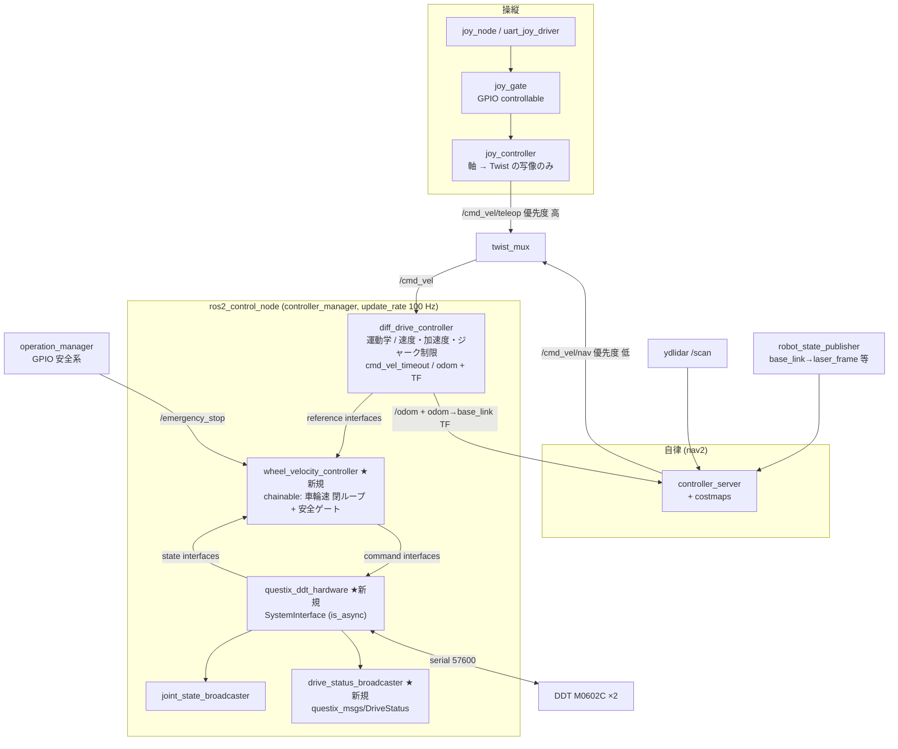

# ros2_control 移行実装案（将来の選択肢 / 現時点では採用しない）

親ドキュメント: [`DRIVE_CONTROL_ARCHITECTURE.md`](DRIVE_CONTROL_ARCHITECTURE.md)（現状分析・Plan A の計画・インターフェース契約はそちら）
状態: 設計提案。**既定の計画からは外している。** Jazzy の実 API 名は §11 の要確認リストで実機確認する前提。

---

## 0. このドキュメントの位置づけ

> **採用は必須ではない。** 一度「nav2 を視野に入れるなら Step 2 の直後に ros2_control へ跳ぶ」と結論したが、以下の理由で取り下げた。詳細な議論は親ドキュメント §5。

**1. nav2 は ros2_control を要求しない。** nav2 が要求するのは `/odom`・`odom → base_link` TF・`/cmd_vel` の購読・`/scan` と TF ツリーという契約だけで、`/odom` と TF は現在の `drive_component` がすでに出している。nav2 の実際のブロッカーは §1 の URDF/TF 未整備であり、これは**どちらの案でも同じだけ必要**である。

**2. 「自作してから捨てるのが一番高い」は成立しなかった。** Step 3（リミッタ統合）は既存 `drive_slew` の整理、Step 4（閉ループ）は `diff_drive_controller` に対応物が無いので**どちらでも自作**、Step 5（調停）は `twist_mux` を使うので**どちらでもコードを書かない**。`odometry_integrator` と `drive_watchdog` は既にテスト付きで存在する。純増分は「固定周期タイマーの薄いラッパ」と「リミッタの一本化」程度しかない。

**3. 依存リスクが非対称である。** ros2_control は本スタックで唯一「upstream の C++ 基底クラスを継承する」依存であり、ほぼ全ディストロで hardware_interface API に破壊的変更が入っている（§11 の要確認リストが長いのは調査不足ではなく、この依存の性質そのものの症状）。nav2 / `twist_mux` / `robot_state_publisher` はトピック契約で話すだけなので曝露が桁違いに小さい。

**4. 第一設計の段階で契約と戦っている。** §3-4 でデバイス消失時に `return_type::ERROR` を返さない設計を推奨した。これは ros2_control のエラー契約を意図的に破るもので、適合していないサインである。加えて `is_async` は ros2_control の中でも踏まれていない道であり、本案件はそこに最も体重を預ける構成になっていた。

### それでも残す理由

- **「何を自作するとどうなるか」の設計材料**として有効。§4 の `diff_drive_controller` 設定案は Plan A のリミッタ設計にそのまま流用でき、§7 のマッピング表は責務の置き場所の議論に使える。
- 親ドキュメント §5 の**再検討トリガー**を引いたとき、そのまま実装計画として使える。
  1. マニピュレータなど多関節のアクチュエータ系を追加する
  2. ロボットを外部へ渡す、標準構成を期待される
  3. 電源設計が変わってデバイスが消えなくなる（上記 4 の不適合が解消する）
- 親ドキュメント §7 の**インターフェース契約**どおりに Plan A を作れば、そのときの移行は書き直しではなく**アダプタ 1 枚**で済む。制御則・運動学・プロトコル・PI は無変更で載る。

### 読み替えの対応

| このドキュメントの記述 | Plan A での扱い |
|---|---|
| §1 nav2 前提条件（URDF / TF） | **そのまま必要。** 親ドキュメント Step B0 |
| §3 hardware component | `ddt_bus_driver`（Step 1）＋ `IWheelBus` / `ISerialTransport` として実装 |
| §3-4 デバイス消失の内部吸収 | **そのまま採用。** 自作なら契約違反にもならない |
| §3-5 デバイス癖の置き場 | **そのまま採用。** `IWheelBus` の裏に閉じ込める |
| §4 `diff_drive_controller` 設定案 | 自作 `Limiter` のパラメータ設計として流用（ジャーク換算も含む） |
| §5 `wheel_velocity_controller` | `DriveController` の `ChassisLoop` 段（Plan V / Plan C の分岐はそのまま有効） |
| §6 `drive_status_broadcaster` | 自作ノード内の publish タイマー。契約は不変 |
| §9 B0〜B8 | B0 は必要。B1〜B8 は Step 1〜5 に読み替え |

---

## 1. nav2 の前提条件ギャップ（最優先で潰す）

コードを読んだ限り、**現状 nav2 は起動しても動かない**。ros2_control の前に、あるいは並行してここを埋める必要がある。

### 1-1. TF ツリーが繋がっていない

- `description_launch/urdf/questix.xacro` は **`base_link` 1リンクのみ**（メッシュ表示だけ）。車輪ジョイント、LiDAR リンク、collision/footprint が無い。
- `launcher/launch/questix_core.launch.xml` は **`description_launch` を include していない**。つまり統合起動で `robot_state_publisher` が動いていない。
- `launcher/config/lidar_params.yaml` の `frame_id: laser_frame` に対して、`base_link → laser_frame` の TF を出すものが存在しない。

現在の TF ツリー:

```
odom → base_link          (drive_component の publishOdometry)
laser_frame               ← 孤立。base_link に繋がっていない
```

nav2 の costmap は `/scan` を `base_link`/`odom` へ変換できず、`global_costmap` も `local_costmap` も立ち上がらない。**ここは ros2_control とは独立した必須作業**。

### 1-2. 必要な作業

- `questix.xacro` に `left_wheel_joint` / `right_wheel_joint`（`continuous`）、車輪リンク、`laser_frame` リンクと `base_link → laser_frame` の固定ジョイント、footprint 用 collision を追加。ros2_control のジョイント宣言もここに入る（§3）。
- `questix_core.launch.xml` に `robot_state_publisher` を組み込む。`description_launch.launch.xml` は**自前で rviz2 を起動している**ので、そのまま include すると `questix_core` の rviz2 と二重起動になる。rviz2 を含まない description-only の launch を切り出す。
- `joint_state_publisher`（GUI 相当のダミー）は ros2_control 導入後 `joint_state_broadcaster` と競合する。ros2_control 有効時は起動しない分岐が必要。
- `map → odom`: SLAM（`slam_toolbox`）か既存地図 + `amcl` のどちらにするかは要議論（§12）。

計測: 実機不要で `ros2 run tf2_tools view_frames` 相当の確認ができる（launch できる環境なら）。

---

## 2. 全体構成



`operation_manager` / `gpio_reader` / `joy_gate` / `shot_component` / `esc_motor_control_cpp` は現状のまま。**GPIO による物理遮断 + ROS ソフト停止の二重経路は維持する**（`launcher/README.md` の設計を崩さない）。

---

## 3. ハードウェアコンポーネント `questix_ddt_hardware`

### 3-1. パッケージ構成

```
questix_ddt_hardware/
  include/questix_ddt_hardware/
    ddt_bus_system.hpp        # hardware_interface::SystemInterface 実装
    serial_transport.hpp      # インターフェース + 実装（fake 差し替え可能）
    ddt_device_session.hpp    # モード/ブレーキ/accel_time/max rpm/再接続
  src/...
  questix_ddt_hardware.xml    # pluginlib plugin description
  test/
    test_ddt_bus_system.cpp   # fake transport で遅延・タイムアウト・CRC 不一致注入
```

既存 `motor_control_lib/ddt_protocol`（純関数 codec）は**そのまま依存して流用する**。書き直さない。

### 3-2. URDF 側の宣言

`questix.xacro` に追加する `<ros2_control>` タグ（案）:

```xml
<ros2_control name="questix_ddt" type="system" is_async="true" thread_priority="50">
  <hardware>
    <plugin>questix_ddt_hardware/DdtBusSystem</plugin>
    <param name="serial_port">/dev/ttyACM0</param>
    <param name="baud_rate">57600</param>
    <param name="left_motor_id">4</param>
    <param name="right_motor_id">5</param>
    <param name="right_motor_invert">true</param>   <!-- 鏡像取付の符号反転はここ -->
    <param name="max_motor_rpm">475</param>
    <param name="control_mode">velocity</param>      <!-- velocity | current -->
    <param name="bus_rate">50.0</param>              <!-- 非同期スレッドのバス周期 [Hz] -->
    <param name="feedback_timeout_ms">10</param>
    <param name="accel_time_0p1ms_per_rpm">1</param>
    <param name="min_command_rpm">5</param>
    <param name="brake_on_stop">false</param>
    <param name="stop_resend_interval_ms">0</param>
    <param name="reconnect_period_sec">1.0</param>
  </hardware>

  <joint name="left_wheel_joint">
    <command_interface name="velocity"/>   <!-- Plan V。Plan C では effort -->
    <state_interface name="velocity"/>
    <state_interface name="position"/>     <!-- ロータ位置の積算。無くても nav2 は動く -->
  </joint>
  <joint name="right_wheel_joint">
    <command_interface name="velocity"/>
    <state_interface name="velocity"/>
    <state_interface name="position"/>
  </joint>

  <gpio name="ddt_bus">
    <state_interface name="connected"/>    <!-- 1.0 = ポート open かつフィードバック新鮮 -->
    <command_interface name="brake"/>      <!-- 1.0 = 電気ブレーキ投入 -->
  </gpio>
  <gpio name="left_wheel">
    <state_interface name="current_amp"/>
    <state_interface name="fault_code"/>
    <state_interface name="mode"/>
    <state_interface name="feedback_age"/>
  </gpio>
  <gpio name="right_wheel">
    <state_interface name="current_amp"/>
    <state_interface name="fault_code"/>
    <state_interface name="mode"/>
    <state_interface name="feedback_age"/>
  </gpio>
</ros2_control>
```

**単位の注意**: ros2_control のジョイント速度は **rad/s**。RPM 変換（`rad/s = rpm × 2π/60`）と**右モータの符号反転はハードウェア層に閉じ込める**。現在は `DifferentialDrive::motorVelocitiesToTwist` が `-1` を運動学に混ぜているが、`diff_drive_controller` は左右とも「正 = 前進」を前提とするため、ここを移さないと必ず破綻する。移行時の第一級の落とし穴。

### 3-3. `read()` / `write()` の設計

`is_async="true"` なので `read`/`write` は専用スレッドで走り、`controller_manager` の update 周期をブロックしない（§11 で要確認）。

- **バスは1本、request-response**。`read` と `write` を独立に呼ぶのではなく、内部スレッドが「指令フレーム送信 → フィードバック受信」を1トランザクションとして `bus_rate` 周期で回し、`read()`/`write()` は**そのスレッドとの共有バッファへのコピーだけ**にする。ここが Step 1 の `ddt_bus_driver` と同じ構造。
- 帯域の見積り（57600 baud 8N1 = 5,760 B/s）:

| バス周期 | 1周期のバイト数 | 占有率 |
|---|---|---|
| 100 Hz | 2 モータ × 20 B = 40 B | **69 %** |
| 50 Hz | 40 B | 35 % |
| 50 Hz @115200 baud | 40 B | 17 % |

  → `controller_manager` は 100 Hz、バスは 50 Hz から始める。baud を上げられるならバス周期も上げられる（親ドキュメント §3-4 の要確認事項）。

### 3-4. デバイス消失（非常停止で USB CDC が消える）の扱い

**ここが ros2_control 移行の最大の設計判断**である。

素直に実装すると `read()` が失敗 → `return_type::ERROR` → `controller_manager` がハードウェアとコントローラを落とす → 復帰には外部から `/controller_manager/set_hardware_component_state` を叩く supervisor が必要になり、現在の `lifecycle_auto_start` より複雑になる。

**推奨: デバイス消失をハードウェアコンポーネント内部で吸収する。**

- ポートが無い / open 失敗 / 応答が無い場合も `read()`/`write()` は **`return_type::OK` を返す**。
- 内部の再接続スレッドが `reconnect_period_sec` 周期で open を再試行し、成功したら `DdtDeviceSession` がモード・`accel_time`・max RPM を再設定する。
- 状態は `ddt_bus/connected` state interface（0.0/1.0）で公開する。
- コントローラ側（`wheel_velocity_controller`）が `connected == 0.0` を見て指令をゼロに落とし、閉ループ状態をリセットする。

これで `controller_manager` は一度 activate したら落ちず、現在の「未通電で待機 → 通電で自動復帰」という運用がそのまま維持できる。`return_type::ERROR` は**復帰不能な異常（fd の恒久的な異常など）に限定**する。

`ERROR` を返さない設計は ros2_control の作法から少し外れるが、「非常停止のたびにハードウェアが消える」という本プロジェクト固有の前提に対しては、こちらの方が運用が単純で安全側に倒れる。判断として明記しておく。

### 3-5. デバイス癖の置き場

`min_command_rpm`（低速不感帯）・`brake_on_stop`・`stop_resend_interval_ms`・`accel_time_0p1ms_per_rpm` は**制御則ではなくデバイスの癖**なので、ハードウェアコンポーネントに置く。制御層（コントローラ）から見えなくすることで、`diff_drive_controller` のリミッタと干渉しなくなる（親ドキュメント P3 の再発防止）。

ただし `min_command_rpm` は「指令を丸める」= 制御ループから見れば非線形要素なので、Plan C（§5-2）で閉ループを host に持ってきた場合は**不要になる可能性が高い**。B6 で再評価する。

---

## 4. `diff_drive_controller` の設定案

`launcher/config/questix_controllers.yaml`（新規、単一ソース）:

```yaml
controller_manager:
  ros__parameters:
    update_rate: 100  # Hz
    joint_state_broadcaster:
      type: joint_state_broadcaster/JointStateBroadcaster
    wheel_velocity_controller:
      type: questix_controllers/WheelVelocityController
    diff_drive_controller:
      type: diff_drive_controller/DiffDriveController
    drive_status_broadcaster:
      type: questix_controllers/DriveStatusBroadcaster

diff_drive_controller:
  ros__parameters:
    # chainable な wheel_velocity_controller の参照インターフェースを指す。
    # 命名規則は Jazzy の実装で要確認（§11）。
    left_wheel_names: ["wheel_velocity_controller/left_wheel_joint"]
    right_wheel_names: ["wheel_velocity_controller/right_wheel_joint"]

    wheel_separation: 0.5      # 現 drive_component.yaml と同値
    wheel_radius: 0.1
    publish_rate: 50.0         # 現 status_publish_rate と同値
    odom_frame_id: "odom"
    base_frame_id: "base_link"
    enable_odom_tf: true       # 現 publish_tf: true と同義
    open_loop: false           # 実測車輪速から odom を作る（現行と同じ方針）
    position_feedback: false   # velocity state interface を使う
    cmd_vel_timeout: 1.0       # 現 cmd_timeout_sec: 1.0 と同値
    use_stamped_vel: false     # twist_mux / nav2(Jazzy) の Twist に合わせる（§11 要確認）

    # 現 publishOdometry の固定共分散をそのまま移植
    pose_covariance_diagonal:  [0.01, 0.01, 1.0e6, 1.0e6, 1.0e6, 0.05]
    twist_covariance_diagonal: [0.01, 1.0e6, 1.0e6, 1.0e6, 1.0e6, 0.05]

    # 速度・加速度・ジャーク制限。ここが唯一のプロファイル源（親ドキュメント P3 の解消）
    linear.x.has_velocity_limits: true
    linear.x.max_velocity: 2.0        # 現 longitudinal_input_ratio 2.0 を上限として移設
    linear.x.min_velocity: -2.0
    linear.x.has_acceleration_limits: true
    linear.x.max_acceleration: 3.0    # 現 max_linear_accel
    linear.x.has_jerk_limits: true
    linear.x.max_jerk: 45.0           # 下記の換算による初期値

    angular.z.has_velocity_limits: true
    angular.z.max_velocity: 6.0       # 現 angular_input_ratio 6.0
    angular.z.min_velocity: -6.0
    angular.z.has_acceleration_limits: true
    angular.z.max_acceleration: 3.0   # 現 max_angular_accel
    angular.z.has_jerk_limits: true
    angular.z.max_jerk: 45.0
```

### 4-1. 現行パラメータの移設換算

**ジャーク制限の初期値**: 現在の `slew_taper_band_*` は「残差がバンド内で指令レートを比例的に絞る」= 時定数 `band / max_accel` の指数接近であり、実効的なジャーク制限として働いている。バンド突入時の等価ジャークは

```
等価ジャーク ≒ max_accel² / taper_band
```

`max_linear_accel 3.0`, `slew_taper_band_linear 0.2` → 45 m/s³。角速度側も `3.0² / 0.2` = 45 rad/s³。これを初期値にする。

ただし `diff_drive_controller` のジャーク制限は**加速度変化量の一律クランプ**で、テーパーの指数接近とは形が違う。到達直前の挙動は同一にならないので、B3 の実機確認で再調整前提とする。

**デマンド適応加速度（`min_*_accel` / `accel_demand_ref_*`）には対応物が無い。**

これは「イベント駆動 + オープンループ」という制約下で操縦感を作るためのヒューリスティックだった。固定周期 + ジャーク制限 + 閉ループが入れば役割の大半を失うので、**廃止を提案する**。それでも操縦感として必要なら、`joy_controller` 側（= 操縦者の意図の写像）に置くのが筋で、制御層には戻さない。

**`min_angular_accel: 0.15` が実質的な角速度ローパスとして効いている**点は注意。廃止するとスティックのジッタがそのまま通るので、必要なら `joy_controller` に素直なローパスか deadzone 拡大を入れる（`joy_node` の `deadzone: 0.1` も再評価対象）。

---

## 5. `wheel_velocity_controller`（chainable、新規）

`questix_controllers` パッケージに置く。`controller_interface::ChainableControllerInterface` を実装し、

- **参照インターフェースを export**: `left_wheel_joint/velocity`, `right_wheel_joint/velocity` → `diff_drive_controller` からはコマンドインターフェースに見える
- **状態インターフェースを claim**: 車輪 velocity、`ddt_bus/connected`、`left/right_wheel/fault_code`, `feedback_age`
- **コマンドインターフェースを claim**: 車輪 velocity（Plan V）または effort（Plan C）、`ddt_bus/brake`
- `/emergency_stop`（`questix_msgs/EmergencyStop`）を購読する（コントローラは `get_node()` から subscription を作れる）

### 5-1. Plan V: ファーム速度ループの上に補償を載せる（低リスク）

```
diff_drive_controller → 車輪速 ref [rad/s]
  → wheel_velocity_controller: ref + PI(ref - measured) → 車輪速 cmd [rad/s]
    → hardware: rad/s → RPM → Protocol 1 (velocity)
```

- `mode: passthrough` なら現行の Step 2 相当の挙動（B3 の段階ではこれ）。
- `mode: pi_on_velocity` で補償を入れる。
- **カスケードの注意**: 内側（ファーム速度ループ）が 1.8 Hz で振動している系の上に外側ループを載せるので、外側の帯域は内側よりはっきり低く取る必要がある。ゲインを上げると内側の振動を励起する。親ドキュメント Step 0 の周波数特性同定が前提。

### 5-2. Plan C: 電流モードでホストが速度ループを持つ（本命だが要検証）

```
diff_drive_controller → 車輪速 ref [rad/s]
  → wheel_velocity_controller: PI(ref - measured) → effort (電流) [A]
    → hardware: A → 電流生値 → Protocol 1 (current)
```

- 既存 `ddt_current_pi`（テスト付き）がそのまま `wheel_velocity_controller` の中身になる。
- ファームの速度ループを迂回するので、1.8 Hz のリミットサイクルと低 RPM の減衰不足を**構造的に解消できる**。`min_command_rpm` の不感帯も不要になる見込み。
- 一方で、速度ループの安定性・停止保持・過電流保護の責任がすべてホスト側に移る。制御周期の欠落（バスの一時的な無応答）が即座に危険側に働くので、`connected`/`feedback_age` によるフェイルセーフとトルク制限が必須。
- 電気ブレーキは velocity モード専用（`DdtMotorLib::setBrakeOnStop` のコメント）なので、**Plan C では停止保持の手段が変わる**。ゼロ速度を PI で保持するか、停止時だけ velocity モードへ切り替えるか。後者はモード切替がバス往復を要するので、切替頻度と遅延を実機で確認する必要がある。

**推奨**: B6 で `mode` パラメータとして両方実装し、`passthrough` → `pi_on_velocity` → `pi_to_effort` の順に実機で上げていく。撤退が 1 パラメータで済む。

### 5-3. 安全ゲート（毎 update 実行）

優先順で:

1. `/emergency_stop` の `active == true` → 出力ゼロ + `brake = 1.0` + PI リセット
2. `connected == 0.0` または `feedback_age` 超過 → 出力ゼロ + PI リセット
3. `fault_code != 0` → 出力ゼロ + PI リセット + throttle ログ
4. `diff_drive_controller` の `cmd_vel_timeout` は上流で効くので二重には持たない

`AGENTS.md` の防止チェックリスト（PI 積分のリセット関数をモード遷移・停止・フィードバックタイムアウトで呼ぶ）が、この 1 箇所に集約される。

---

## 6. `drive_status_broadcaster`（新規）

`/drive_status`（`questix_msgs/DriveStatus`）の契約を維持するためのブロードキャスタ。`robot_manager` と `questix_msgs/README.md` の契約を壊さないことが目的。

- state interface（車輪 velocity, `current_amp`, `fault_code`, `mode`, `feedback_age`）を読み、`DriveStatus` を組んで publish。
- **表示用の実測 RPM ローパス（現 `measured_lpf_tau_sec: 0.15`）はここに置く**。制御用フィードバック（`wheel_velocity_controller`）は生値または短い時定数を使い、**制御用と表示用を分離する**（親ドキュメント P7 の解消）。
- `DriveStatus.emergency_stop` は `/emergency_stop` の購読で埋める。

`questix_msgs` 側の変更は不要。既存 `MotorFeedback` / `DriveStatus` をそのまま使える（親ドキュメント §4 で提案した `WheelCommand`/`WheelState` は、ros2_control では command/state interface が担うので**不要になる**）。

---

## 7. 既存コードの移設先マッピング

| 現在の実装 | 移設先 | 備考 |
|---|---|---|
| `drive_slew`（accel / demand適応 / taper） | `diff_drive_controller` の velocity/accel/jerk limits | demand 適応は廃止提案（§4-1） |
| `drive_watchdog::shouldTimeoutStop` | `diff_drive_controller` の `cmd_vel_timeout` | |
| `drive_watchdog::decideTwistAction/decideEstopAction` | `wheel_velocity_controller` の安全ゲート | テストは移植可 |
| `odometry_integrator` + `publishOdometry` + TF | `diff_drive_controller`（`enable_odom_tf`, covariance） | 共分散値はそのまま移設 |
| `DifferentialDrive` の twist↔RPM 変換 | `diff_drive_controller` の運動学 | **右モータ符号反転は hardware へ**（§3-2） |
| `drive_stop_gate` / `min_command_rpm` | ハードウェアコンポーネント | Plan C で不要になる見込み |
| `brake_on_stop` / `stop_resend_interval_ms` / `accel_time` | ハードウェアコンポーネント | デバイス癖 |
| `ddt_current_pi` | `wheel_velocity_controller`（Plan C） | 既存テスト活用 |
| `measured_lpf_tau_sec` | `drive_status_broadcaster`（表示用のみ） | 制御用は生値 |
| `lifecycle_auto_start` | ハードウェア内部の再接続スレッド | CM の lifecycle は使わない（§3-4） |
| `DdtMotorLib` のシリアル / termios / retry | `questix_ddt_hardware/SerialTransport` | fake 差し替え可能に |
| `ddt_protocol`（純関数 codec） | **そのまま流用** | 書き直さない |
| `/drive_status` publish | `drive_status_broadcaster` | 契約維持 |
| `/emergency_stop` 購読 | `wheel_velocity_controller` + hardware の brake | GPIO 物理遮断経路は不変 |
| `joy_controller` | **ほぼそのまま**（`/cmd_vel/teleop` へ改名） | 写像のみに保つ |
| `joy_gate` / `gpio_reader` / `operation_manager` | **変更なし** | |
| 指令調停（親ドキュメント `cmd_arbiter`） | `twist_mux`（既製） | 自作しない |

**消えるファイル**が多い。`drive_component.cpp`（765 行）は最終的に無くなり、残るのは `questix_ddt_hardware` + 小さいコントローラ 2 本になる。これが「無理やり合わせる形」から抜ける実体。

---

## 8. 起動・運用への影響

### 8-1. launch

- `ros2_control_node`（`controller_manager`）を 1 プロセス追加。`robot_description` は Iron 以降 **`/robot_description` トピック経由**なので、`robot_state_publisher` の起動が必須（§1-2 と繋がる）。
- spawner 順序: `joint_state_broadcaster` → `wheel_velocity_controller`（chained、先に active） → `diff_drive_controller` → `drive_status_broadcaster`。chainable の activate 順序を間違えるとインターフェース claim に失敗する。
- **移行期は launch 引数で切替可能にする**: `use_ros2_control:=true/false` で `drive_component`（現行）と ros2_control スタックを排他起動する。大会運用中に片方が壊れても戻せる状態を保つ。
- `description_launch.launch.xml` の rviz2 / `joint_state_publisher` は ros2_control と競合するので、description-only の launch を分離（§1-2）。

### 8-2. systemd / ansible / robot_manager

`AGENTS.md` の「Installer/unit consistency」に従い、以下 3 箇所を同時に更新する:

- `systemd/questix_robot*`
- `scripts/install-robot-manager.sh` の置換
- `ansible/roles/robot_autostart/templates/`

`robot_manager` は `/drive_status` 契約が維持されるので（§6）、表示側の変更は不要な見込み。要確認: lifecycle 状態を UI に出している箇所があれば、`controller_manager` のコントローラ状態に読み替えが必要。

### 8-3. 依存追加

`rosdep` 対象に `ros-jazzy-ros2-control`, `ros-jazzy-ros2-controllers`（`diff_drive_controller`, `joint_state_broadcaster` を含む）, `ros-jazzy-twist-mux`, nav2 一式。`package.xml` の更新漏れは `rosdep install` を新規環境で壊すので注意（`AGENTS.md` cf. #64）。

---

## 9. 段階移行 B1〜B8

Step 2 の完了後。親ドキュメントと同じく「挙動不変」と「挙動変更」を交互にする。

| # | 内容 | 挙動 | 実機 |
|---|---|---|---|
| **B0** | URDF 整備（車輪ジョイント・`laser_frame`・footprint）+ `robot_state_publisher` を統合起動へ + description-only launch 分離 | 変えない（TF が増えるだけ） | 不要（TF 確認のみ） |
| **B1** | `questix_ddt_hardware` 実装。`mock_components/GenericSystem` と実ハードの両方で立ち上げ確認 | — | 一部 |
| **B2** | `joint_state_broadcaster` + `diff_drive_controller` + `wheel_velocity_controller(passthrough)` で走行。odom/TF を `diff_drive_controller` へ移譲 | **Step 2 相当を目標** | 必要 |
| **B3** | `drive_status_broadcaster` 投入。`/drive_status` 契約と `robot_manager` の無影響確認 | 変えない | 必要 |
| **B4** | 安全系: `ddt_bus/brake` / `connected` / `/emergency_stop` を組み込み、GPIO 二重経路を再確認 | 変えない（安全側は強化） | **必要** |
| **B5** | リミッタを `diff_drive_controller` に一本化。demand 適応廃止、ジャーク制限へ移設（§4-1） | **変える** | 必要 |
| **B6** | `wheel_velocity_controller` の `mode` を `pi_on_velocity` → 必要なら `pi_to_effort` へ（§5） | **変える（本題）** | 必要 |
| **B7** | `twist_mux` で teleop / nav2 調停。`joy_controller` を `/cmd_vel/teleop` へ | 変えない（teleop 単独時） | 必要 |
| **B8** | nav2 立ち上げ（SLAM か map+AMCL、costmap、controller_server） | 新機能 | 必要 |
| — | `drive_component` 削除 | — | B2〜B6 が安定してから |

B2 に到達すれば `use_ros2_control:=false` で現行に戻せる状態が保たれる。**B6 が本題**であり、B0〜B5 はそこへ安全に到達するための整備である。

### 9-1. nav2 側の二重リミッタ注意

`nav2_velocity_smoother` と `diff_drive_controller` の両方に加速度制限を持たせると、親ドキュメント P3 と同じ多重プロファイル問題が再発する。**制限は `diff_drive_controller` 側 1 箇所に置き**、`nav2_velocity_smoother` は使わないか制限を無効化する。nav2 の `controller_server`（DWB/MPPI）が持つ加速度制約は「軌道生成の前提値」なので、`diff_drive_controller` の設定値と**一致させる**必要がある（無効化ではなく整合）。

---

## 10. 検証方法

### 実機なしでできること（ros2_control 化で大幅に増える）

- **`mock_components/GenericSystem`**: ハードウェア無しで `diff_drive_controller` + `wheel_velocity_controller` + `twist_mux` + nav2 までの配線を検証できる。B8 の costmap / TF / `/cmd_vel` 経路の確認は実機前にここで済ませる。**これが ros2_control 採用の最大の実利**。
- **fake transport 単体テスト**: `SerialTransport` をインターフェース化し、遅延・タイムアウト・CRC 不一致・デバイス消失を注入して `read`/`write`/再接続を検証。現在はシリアルが `DdtMotorLib` に埋まっていてできない。
- **コントローラ単体テスト**: `ros2_control_test_assets` を使った controller テストで、ステップ応答・PI リセット・安全ゲートの優先順・`connected == 0` 時の挙動を検証。
- **プラント模擬**: ファーム速度ループを 1〜2 次系 + 不感帯としてモデル化し、Plan V のカスケード安定余裕と Plan C のゲイン上限をオフラインで当たりを付ける。
- 配線確認: `ros2 control list_hardware_interfaces` / `list_controllers` / `ros2 topic hz` / `tf2_tools view_frames`。
- 既存 CI 相当: `colcon build --symlink-install`、`colcon test`、`ament_clang_format`。

### 実機必須

- ファーム速度ループの周波数特性同定（親ドキュメント Step 0）→ B6 のゲイン上限
- `is_async` の実効性（`controller_manager` の update 周期がシリアル待ちで崩れないか）→ B1
- シリアル帯域と baud 引き上げ可否 → B1
- 非常停止時のデバイス消失・再接続シーケンス（§3-4）→ **B4、安全に直結**
- Plan C の停止保持と過電流挙動 → B6
- nav2 の実走（LiDAR 品質、costmap、footprint）→ B8

---

## 11. 要確認事項（Jazzy の実 API / パラメータ名）

以下は記憶ベースで書いているので、**実装前に Jazzy の実インストールで確認する**。確認できるまで設計判断の根拠にしない。

| 項目 | 確認方法 |
|---|---|
| `<ros2_control>` の `is_async` / `thread_priority` の対応と挙動 | `ros2_control` の `hardware_info` パーサ実装、および B1 の実測 |
| `ChainableControllerInterface` の export シグネチャ（`on_export_reference_interfaces` か `export_reference_interfaces`） | `/opt/ros/jazzy/include/controller_interface/chainable_controller_interface.hpp` |
| 参照インターフェースの命名規則と `left_wheel_names` の書き方 | 同上 + `ros2 control list_hardware_interfaces` の実出力 |
| `diff_drive_controller` の `use_stamped_vel` の有無・既定値 | `ros2 param describe /diff_drive_controller use_stamped_vel` |
| nav2(Jazzy) の `/cmd_vel` の型（`Twist` か `TwistStamped`） | `ros2 topic info -v /cmd_vel` |
| `twist_mux`(Jazzy) の出力型 | 同上 |
| `<gpio>` タグの state/command interface 命名規則 | `hardware_info` パーサ + `list_hardware_interfaces` |
| `diff_drive_controller` の加速度/ジャーク制限パラメータ名（`linear.x.max_jerk` 等） | `ros2 param list /diff_drive_controller` |

Twist / TwistStamped の型不一致は Jazzy 前後で変わっている箇所なので、**`twist_mux` → `diff_drive_controller` → nav2 の 3 者で型を揃える**確認を B7 の最初にやる。

---

## 12. リスクと撤退

| リスク | 対策 |
|---|---|
| `is_async` が期待通り動かず update 周期が崩れる | `update_rate` を 50 に落として同期運用。`bus_rate` と `feedback_timeout_ms` を 20 ms 予算内に収める |
| B6 の閉ループでファーム振動を励起 | `mode: passthrough` に 1 パラメータで戻せる設計にする |
| nav2 前提条件（§1）の工数が想定超過 | B0 を独立 PR にして先に完了させる。ros2_control と切り離す |
| 大会期間中の不安定化 | `use_ros2_control:=false` で現行に戻せる状態を B6 まで維持 |
| systemd/ansible/robot_manager の整合漏れ | ノード構成が変わる B2 と B7 で 3 点セットを同時更新（`AGENTS.md`） |
| Plan C で停止保持ができない | velocity モードとの動的切替、または B6 を Plan V で止める |

**撤退ライン**: B2 到達後は常に `use_ros2_control:=false` で現行構成に戻れる。B5/B6 は挙動変更なので、それぞれ単独 PR にして revert 可能に保つ。

---

## 13. 議論したい点（更新）

1. **nav2 の地図戦略**: SLAM（`slam_toolbox`）か、事前地図 + `amcl` か。競技フィールドが既知なら後者だが、`map → odom` の運用が変わる。
2. **B0 の URDF 整備を誰がやるか**。車輪ジョイント・LiDAR 取付位置・footprint は実機の実寸が必要で、ここが全体のクリティカルパスになる可能性が高い。
3. **Plan V か Plan C か**（§5）。電流モードでホストが速度ループを持つのが構造的には正しいが、停止保持と過電流の責任が移る。実機での判断。
4. **シリアル baud を上げられるか**。57600 → 115200 でバス周期の余裕が倍になり、B6 の選択肢が広がる。
5. **デマンド適応加速度を捨ててよいか**（§4-1）。操縦者の体感として必要なら `joy_controller` 側に持つ形で残す。
6. **`single_ddt_motor` / `joy_axis_drive` / `esc_motor_control_cpp`** を ros2_control に載せるか、デバッグ用として現行のまま残すか。`/dev/ttyACM0` を複数ノードが開く現状のバス競合は別途整理が必要。
